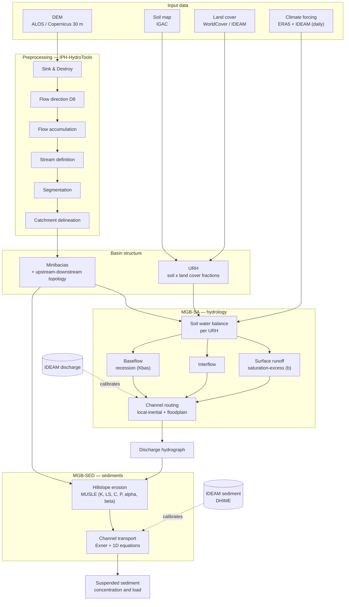

# Suspended Sediment Transport in the Magdalena Basin under Contrasting ENSO Phases — MGB-SED

Research internship — **Universidad Militar Nueva Granada (UMNG), Colombia**
Advisor: **Prof. Briceño Zuluaga** · Program: EMINES
Status: **active** · Last update: 2026-07-27

---

## 1. One-paragraph summary

This project simulates and compares **suspended sediment transport in the Magdalena River basin (Colombia)**
during two climatically contrasting years — a **La Niña** year (2011) and an **El Niño** year (2015–2016 or 2017, *to be confirmed*) —
using the **MGB-SED** hydrological–hydrodynamic–sediment model. It is a transposition to Colombia of the
approach developed by **Fagundes et al.** for the flood events of southern Brazil.

## 2. Objectives and hypotheses

See [`docs/00_objectives_and_hypotheses.md`](docs/00_objectives_and_hypotheses.md).
Short version:

- **Main objective** — quantify and explain the difference in suspended sediment fluxes between a La Niña and an El Niño year in the Magdalena.
- **Method** — build, calibrate and run MGB-SED for the basin; compare the two scenarios.
- **Central hypothesis** — contrasting ENSO phases produce a **detectable, physically interpretable** difference in sediment fluxes that a calibrated MGB-SED can reproduce.

## 3. How the model works (structure)

Full description in [`docs/04_model_structure.md`](docs/04_model_structure.md). Two coupled parts:

- **MGB-SA** — hydrology + hydrodynamics (rainfall → runoff → discharge, floodplain routing).
- **MGB-SED** — sediments (MUSLE erosion per catchment → channel transport by Exner/1D equations).

Full model graph (inputs → preprocessing → structure → sub-models → outputs; dashed arrows = calibration data):



A second, more detailed pair of diagrams (this flow plus the preprocessing chain on its own) is in `docs/04_model_structure.md`.

## 4. Repository map

```
magdalena-mgb-sed/
├── README.md                     <- you are here
├── docs/                         <- scientific documentation (English)
│   ├── 00_objectives_and_hypotheses.md
│   ├── 01_scientific_background.md
│   ├── 02_data_sources.md
│   ├── 03_methodology.md
│   ├── 04_model_structure.md
│   ├── 05_data_collection_plan.md
│   ├── 06_ideam_stations.md
│   ├── open_questions.md         <- the 3 decisions to lock with the advisor
│   └── progress_journal.md       <- dated log, UPDATED AT EACH STEP
├── notebooks/                    <- didactic notebooks (the maths behind each step)
│   ├── 01_dem.ipynb
│   ├── 02_urh.ipynb
│   └── 03_hydrology.ipynb
├── src/                          <- reusable Python (future)
├── data/                         <- inputs (not versioned; see data/README.md)
│   ├── raw/  processed/
├── results/                      <- calibration outputs, final figures (future)
├── figures/                      <- exported figures used in docs
├── requirements.txt
└── LICENSE
```

## 5. Current progress (high level)

> **Current focus:** complete and calibrate **MGB-SA (hydrology)** first. The sediment module (MUSLE, α/β) is
> deferred until discharge calibration works — hydrology must be calibrated before sediments in any case.


| Phase | Description | Status |
|------|-------------|--------|
| 0 | Environment setup (QGIS 3.44 LTR, IPH-HydroTools, MGB, MGB-SED), preprocessing tested on a ~3000 km² test zone (198 minibacias) | **Done** |
| 1 | Data preparation: DEM → minibacias, and URH (soil × land use) | **Understood / in progress** |
| 2 | Hydrological calibration on IDEAM discharge | Mechanism understood (notebook 03); calibration not started |
| 3 | Sediment calibration (MUSLE α, β; Fagundes rain/slope thresholds) | Not started |
| 4 | Scenario comparison (La Niña 2011 vs El Niño) | Not started |
| 5 | Analysis and reporting | Not started |

Detailed, dated progress in [`docs/progress_journal.md`](docs/progress_journal.md).

## 6. Open questions (blocking decisions)

1. **IDEAM sediment stations** on the Magdalena — which, where, which periods? *(highest risk: no calibration data ⇒ no project)*
2. **Confirm the years** — 2011 (La Niña) vs 2015–2016 or 2017 (El Niño).
3. **Whole basin or sub-basin?** — the full Magdalena at 30 m exceeds IPH-HydroTools' ~250 M cell limit.

Details in [`docs/open_questions.md`](docs/open_questions.md).

## 7. Immediate next step

Advance the **MGB-SA (hydrology)** track: (a) decide basin extent — sub-basin vs whole (Q3); (b) identify IDEAM
**discharge** stations for the chosen area; (c) run the real preprocessing + URH on that basin; (d) run and
**calibrate discharge** (NSE/KGE/PBIAS). The sediment-station (DHIME) search is deferred with the sediment module.

## 8. How this repository is maintained

This is a **living repository**. At each new step of understanding or realization, we update:
`docs/progress_journal.md` (what was done, dated), the relevant `docs/*.md`, and the status table above.

## 9. Key references

See [`docs/01_scientific_background.md`](docs/01_scientific_background.md) for the annotated list
(Fagundes et al. on South American sediment flows; MGB-SED graphic interface & auto-calibration;
Briceño et al. on ERA5 bias over mountainous terrain; MGB-SED plugin repository).
