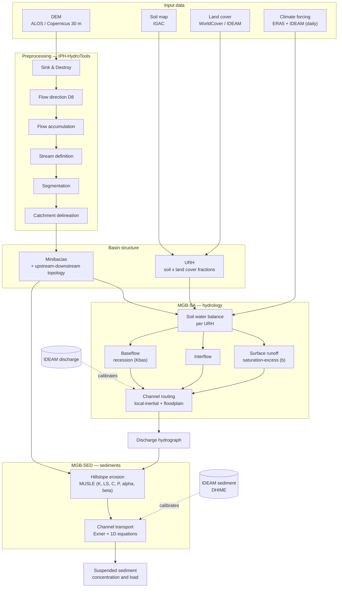

# Model structure

## Overview

MGB-SED couples a hydrological/hydrodynamic core (**MGB-SA**) with a sediment module (**MGB-SED**).
Crucially, the sediment module consumes the **outputs of the hydrology** (runoff volume, peak flow), so the two
must be calibrated in order: hydrology first, sediments second.

## Full model graph (inputs → preprocessing → structure → sub-models → outputs)

Dashed arrows = calibration data.

## Preprocessing chain (DEM → minibacias)

One rule, repeated: water follows the steepest descent, cell by cell.

Each transformation is derived by hand, with the maths and simple Python, in
`notebooks/01_dem.ipynb`. The URH layer (the other structural input) is in
`notebooks/02_urh.ipynb`.

## Reference scheme

The canonical MGB-SED AS scheme (hydrology in blue, sediment in brown; inputs, structure, processes, outputs)
is given in Fagundes et al. (*Sediment Flows in South America…*), figure set. See `01_scientific_background.md`.
